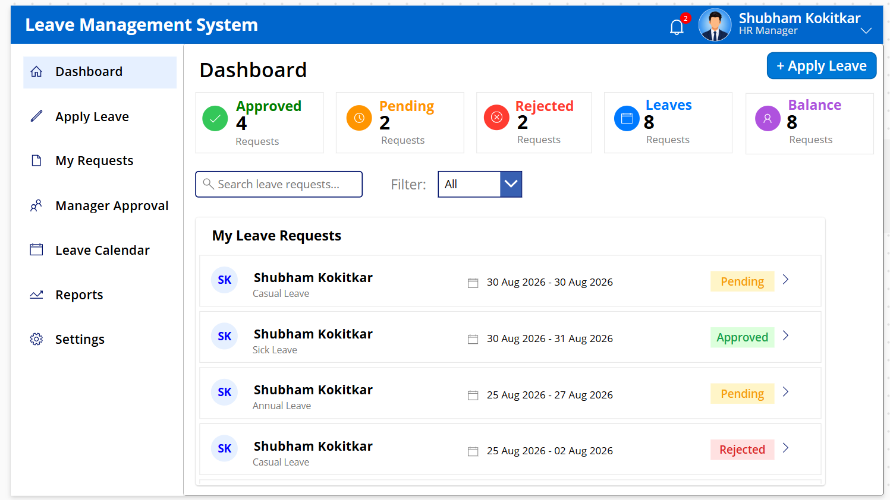
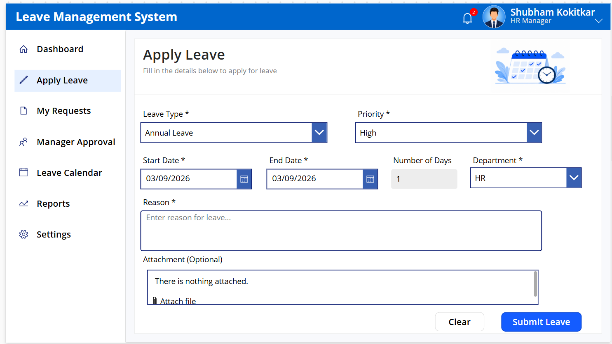
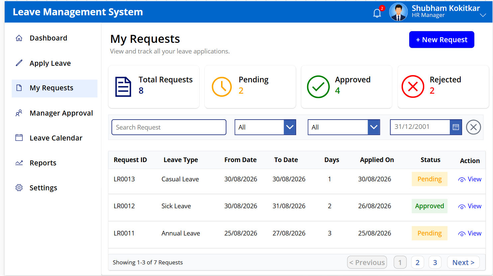
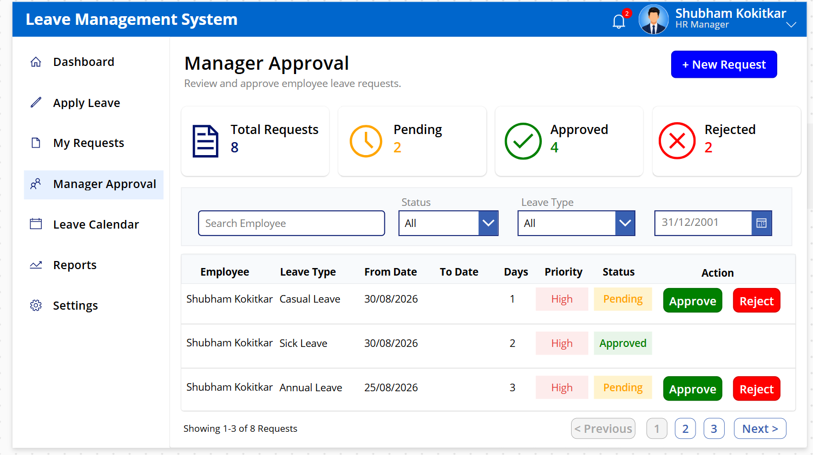
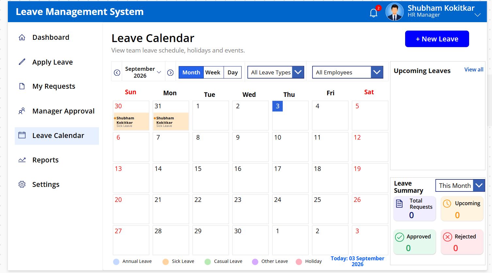
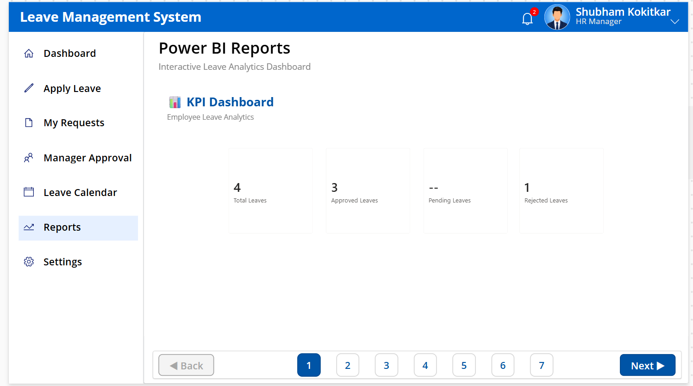
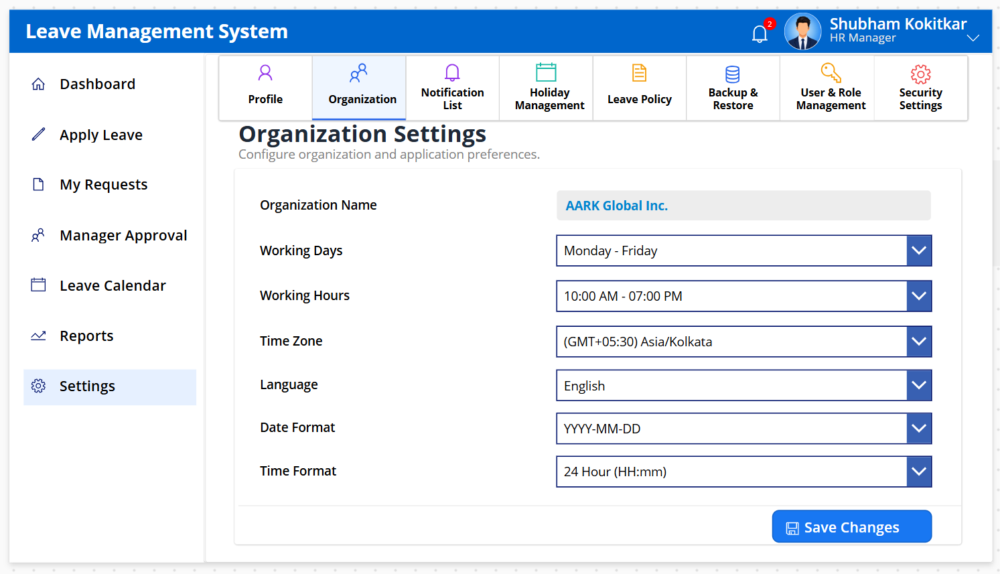

# Leave Management System

## Overview

A business-oriented Leave Management System developed using Microsoft Power Platform for managing employee leave requests, approvals, tracking, and reporting.

## Technologies

* Power Apps
* Power Automate
* SharePoint
* Power BI
* Power Fx

## Features

* Leave request submission
* Edit and delete leave requests
* Manager approval and rejection
* Leave status tracking
* Attachments
* Search and filtering
* Pagination
* Leave calendar
* Dashboard and reports
* SharePoint integration
* Automated approval workflow

## Modules

* Dashboard
* Apply Leave
* My Requests
* Manager Approval
* Leave Calendar
* Reports
* Settings

## Approval Workflow

Employee submits leave request
↓
Power Automate triggers
↓
Manager receives approval request
↓
Manager approves or rejects
↓
SharePoint status is updated
↓
Employee views updated status

## Purpose

This project demonstrates practical experience in developing business applications using Microsoft Power Apps, Power Automate, SharePoint, and Power BI.
## Screenshots

### 01. Dashboard

### 02. Apply Leave

### 03. My Requests

### 04. Manager Approval

### 05. Leave Calendar

### 06. Reports

### 07. Settings

**Note:** This repository is a portfolio/demo representation and does not contain company-confidential data, credentials, or production information.
